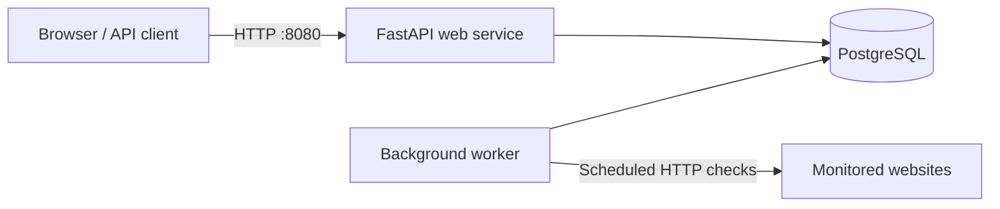

# PulseWatch

PulseWatch is a Python uptime-monitoring service that checks website availability, records HTTP status codes and response times, and displays monitoring history through a web dashboard.

This repository is used as a DevOps portfolio project. The FastAPI application serves as the workload, while my contribution focuses on containerization, multi-service orchestration, database integration, CI/CD, operational reliability, security, and infrastructure automation.

## Features

- User registration and cookie-based authentication
- User-specific website monitors
- Manual and scheduled HTTP checks
- Response-time and uptime history
- Monitor pause and deletion controls
- Basic SSRF protection that blocks private and local network targets
- Health endpoint at `GET /api/health`
- Authenticated monitor API at `GET /api/monitors`

## Architecture



The web and worker containers use the same application image but run different commands:

- `web` serves the dashboard and API through Uvicorn.
- `worker` finds due monitors and performs scheduled checks.
- `db` stores users, monitors, and check results in PostgreSQL.

Docker Compose provides service discovery through the `db` hostname. PostgreSQL data is preserved in a named volume.

## Technology stack

### Application

- Python 3.13
- FastAPI and Uvicorn
- SQLAlchemy
- PostgreSQL and Psycopg
- Pytest

### DevOps

- Docker
- Docker Compose
- GitLab CI/CD
- GitLab Container Registry

## Run with Docker Compose

### Prerequisites

- Docker Desktop or Docker Engine
- Docker Compose v2

Create a `.env` file in the project root:

```dotenv
POSTGRES_USER=pulsewatch_user
POSTGRES_PASSWORD=replace-with-a-local-password
POSTGRES_HOST=db
POSTGRES_PORT=5432
POSTGRES_DB=pulsewatch_db

DATABASE_URL=postgresql+psycopg://pulsewatch_user:replace-with-a-local-password@db:5432/pulsewatch_db
SESSION_SECRET=replace-with-a-long-random-value
```

The real `.env` file is excluded from Git and the Docker build context.

Build the application image:

```bash
docker build -t image_test:v1 .
```

Start the complete stack:

```bash
docker compose up -d
```

Open the application at [http://localhost:8080](http://localhost:8080).

Verify the services:

```bash
docker compose ps
curl http://localhost:8080/api/health
docker compose logs worker
```

Stop the stack:

```bash
docker compose down
```

Use the following command only when you intentionally want to delete the local PostgreSQL data:

```bash
docker compose down -v
```

## Run directly with Python

Python 3.13 is recommended.

```bash
python3 -m venv .venv
source .venv/bin/activate
pip install -r requirements-dev.txt
export SESSION_SECRET="replace-with-a-long-random-value"
python manage.py runserver
```

The direct local setup uses SQLite by default.

Start the background worker in another terminal:

```bash
source .venv/bin/activate
python manage.py worker
```

Manual checks continue to work without the worker, but scheduled checks require it.

## Tests

Run the automated tests with:

```bash
python manage.py test
```

## CI/CD pipeline

The GitLab CI/CD pipeline currently performs four stages:

1. Installs Python dependencies and runs the application tests.
2. Starts an isolated PostgreSQL service and verifies database connectivity.
3. Builds the Docker image and publishes it to GitLab Container Registry using the commit SHA as the image tag.
4. Pulls the published image to verify that it is available from the registry.

The final stage currently verifies image delivery. It is not yet a production deployment.

## Operational commands

```bash
# Display service status
docker compose ps

# Follow all service logs
docker compose logs -f

# Follow individual service logs
docker compose logs -f web
docker compose logs -f worker
docker compose logs -f db

# Recreate containers after configuration changes
docker compose up -d --force-recreate
```

## Security considerations

- Secrets are supplied through environment variables and are not committed.
- Session cookies are cryptographically signed using `SESSION_SECRET`.
- Monitor targets are checked against private and local IP ranges to reduce SSRF risk.
- PostgreSQL is available only through the internal Compose network by default.
- The database volume is kept separate from the application containers.

## Roadmap

- Make Docker Compose build the application image from a clean clone
- Run the application image as a non-root user
- Add application readiness and container health checks
- Add Alembic database migrations
- Add dependency and container-image security scanning
- Add Prometheus metrics, Grafana dashboards, and alerting
- Deploy the application to a real environment
- Add Kubernetes manifests or a Helm chart
- Provision infrastructure using infrastructure as code

## Project scope

PulseWatch intentionally uses a small application so that the repository can demonstrate a complete DevOps lifecycle: packaging, testing, image delivery, orchestration, observability, deployment, and operational documentation.
